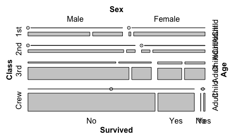
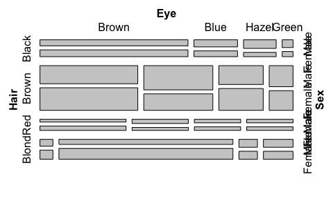
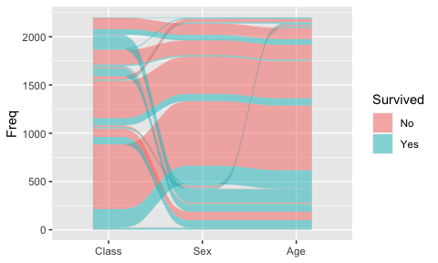

Dear Participants,

We are so excited that you will be joining our tutorial “Graphing
multivariate categorical data: The how, what and why of mosaic plots and
alluvial diagrams” on Wednesday, July 7 from 7:45pm-10:15pm UTC.

In order to get the most out of the workshop, please install the
following or update to the latest version in advance.

**ggalluvial** (0.12.3)

**RColorBrewer** (1.1-2)

**scales** (1.1.1)

**tidyverse** (1.3.0)

**vcd** (1.4-8)

Next please run the following code examples to make sure the above
packages are working. The graphs shown below should appear.

``` r
library(vcd)
```

    ## Loading required package: grid

``` r
mosaic(Titanic)
```

<!-- -->

``` r
mosaic(HairEyeColor)
```

<!-- -->

``` r
library(tidyverse)
library(ggalluvial)
ggplot(as.data.frame(Titanic),
       aes(y = Freq,
           axis1 = Class, axis2 = Sex, axis3 = Age,
           fill = Survived)) +
  geom_alluvium() +
  scale_x_discrete(limits = c("Class", "Sex", "Age"))
```

<!-- -->

Tutorial materials will be added soon to:
<https://github.com/jtr13/graphcat>

Don’t hesitate to contact us in advance if you have any questions:

Joyce Robbins <jtr13@columbia.edu>

Ludmila Janda <ludmila.janda@gmail.com>

Enjoy the conference!

best, Joyce and Ludmila
