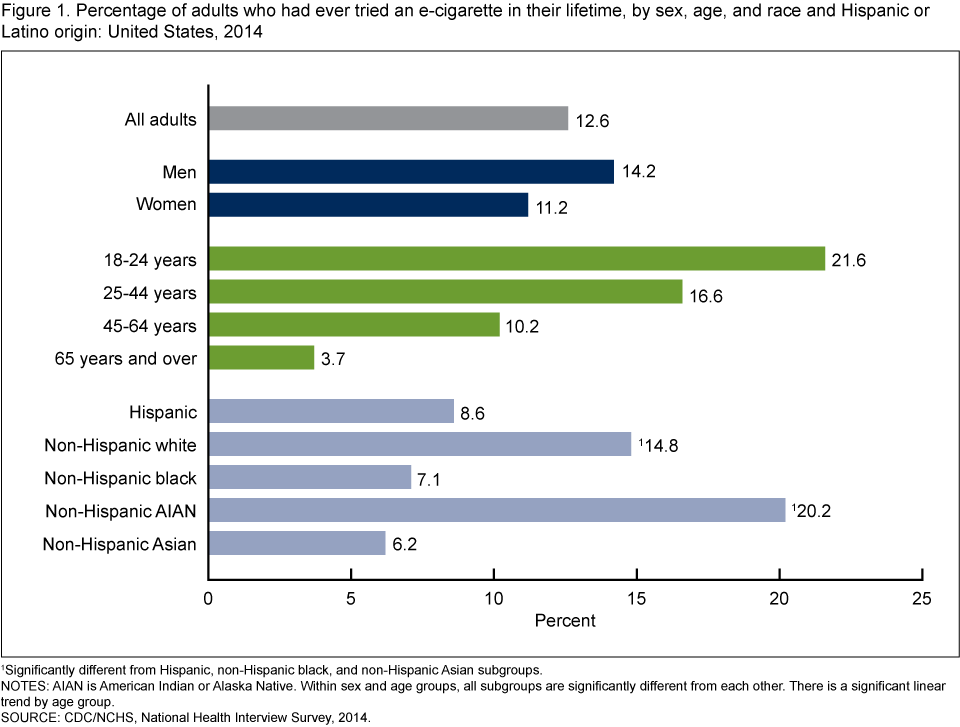

```{r setup, include=FALSE, cache=FALSE}
library(knitr)
options(digits = 3, scipen = 999)
opts_chunk$set(fig.align='center',
               cache=TRUE, message = FALSE, 
               warning = FALSE, echo = FALSE)
```

# Agenda

Minute 0-5 Welcome  

Minute 5-45 Mosaic plots with codealong (Joyce)

Minute 45-85 Alluvial diagrams with codealong (Ludmila)

Minute 85-90 Break

Minute 90-120 Lab (breakout rooms)

Minute 120-150 Discuss lab "results" / wrap up

Materials: https://github.com/jtr13/graphcat

# Graphing multivariate categorical data

**mosaic plot** "area proportional visualization of a (possibly higher-dimensional) table of expected frequencies" (`?vcd::mosaic`)

```{r, fig.width=10, fig.height=4}
load("../data/age_preweight_gain.rda")
mosaic(Gain~Age+Weight, data = df, direction = c("v", "v", "h"),
       spacing = vcd::spacing_dimequal(c(.3, 0, 0)),
       highlighting_fill = RColorBrewer::brewer.pal(7, "Blues"),
       labels = FALSE, varnames = TRUE)
```

each small rectangle is proportional to the frequency count for a unique combination of levels of the categorical variables displayed

`Age`: 7 levels, `Weight`: 4 levels, `Gain`: 7 levels  

--> 7 x 4 x 7 = 196 rectangles

# Graphing multivariate categorical data

**treemap** "a space-filling visualization of hierarchical structures" (`?treemap::treemap`)


```{r, fig.width=10, fig.height=4}
library(treemap)
data("business")
treemap(business[business$NACE1=="C - Manufacturing",],
        index=c("NACE2", "NACE3"),
        vSize=c("employees"),
        type="index")
```


# Numeric data

```{r}
library(ade4)
data("clementines")
str(clementines, vec.len = 8)
```

Data: `clementines` from **ade4** package

# Categorical data

```{r}
library(fivethirtyeight)
str(food_world_cup[,1:12])
```

Data: `food_world_cup` from **fivethirtyeight** package

# Graphing numerical data

```{r, echo = TRUE}
library(tidyverse)
ggplot(clementines, aes(a1, a2)) + geom_point()
```

# Graphing categorical data

```{r, echo=TRUE}
ggplot(food_world_cup, aes(education, location)) + geom_point()
```

# What does multivariate data look like?

Multiple variables but not a multivariate plot:

<figure>
  </img>
  <figcaption>
    https://www.cdc.gov/nchs/images/databriefs/201-250/db217_fig1.png
  </figcaption>
</figure>

# Multivariate categorical data

## Frequency

-   Bar charts
-   Cleveland dot plots

## Proportion / Association

-   Mosaic plots

## Change of state

-   Alluvial diagrams

# Stacked and faceted bar charts

```{r, fig.width=9, fig.height=6}
load("../data/age_preweight_gain.rda")
df %>% group_by(Age, Weight, Gain) %>% 
  mutate(Gain = paste(Gain, "lbs")) %>% 
  summarize(Births = sum(Births)) %>% 
  ungroup() %>% 
ggplot(aes(Age, Births/1000, fill = Gain)) + geom_col(color = "black", lwd = .25) +
  scale_fill_brewer(palette = "Blues") +
  facet_wrap(~Weight) + ylab("Births (in 1000s)") +
  theme_bw(14)+
  theme(panel.grid.major.x = element_blank()) +
  ggtitle("U.S. 2019 Births by Age and Weight Gain",
          sub = "faceted on Prepregnancy Weight")
```

# Cleveland dot plot

```{r}
theme_dotplot <- theme_bw(14) +
    theme(axis.text.y = element_text(size = rel(.75)),
    	axis.ticks.y = element_blank(),
        panel.grid.major.x = element_blank(),
        panel.grid.major.y = element_line(size = 0.5),
        panel.grid.minor.x = element_blank()) 
```

```{r, fig.width=9, fig.height=6}
df %>% group_by(Age, Weight, Gain) %>% 
  mutate(Gain = paste(Gain, "lbs")) %>% 
  summarize(Births = sum(Births)) %>% 
  ungroup() %>% 
  ggplot(aes(x = Births/1000, y = Gain, color = Weight, shape = Weight)) +
  geom_point() + 
  scale_color_manual(values = RColorBrewer::brewer.pal(8, "Blues")[5:8]) +
  scale_shape_manual(values = c(3, 2, 0, 7)) +
  facet_wrap(~Age, ncol = 2) + theme_dotplot + 
  xlab("Births (in 1000s)") + 
  ggtitle("U.S. 2019 Births by Weight Gain and Prepregnancy Weight",
          sub = "faceted on Age")
```

# Proportion / Association

```{r}
# https://www.journalism.org/2019/08/14/methodology-local-news-demographics/

localnews <- data.frame(Age = c("18-29", "30-49", "50-64", "65+"),
                    Freq = c(2851, 9967, 11163, 10911)) %>% 
                    mutate(Followers = round(Freq*c(.15, .28, .38, .42)),
                           Nonfollowers = Freq - Followers)

Overall <- round(sum(localnews$Followers)/sum(localnews$Freq), 3)

```

Are older Americans more interested in local news than younger Americans?

`r sum(localnews$Freq)` U.S. adults were asked whether or not they follow local news "very closely". `r 100*Overall`% said yes.

Group sizes are:

```{r}
localnews[,1:2]
```
<figure>
  <figcaption>
Source: <https://www.journalism.org/2019/08/14/methodology-local-news-demographics/>
  </figcaption>
</figure>  

If older Americans are **NOT** more interested in local news, what would the breakdowns look like?

# Assumption of no association between age and group


```{r}
expected <- data.frame(Age = localnews$Age, Freq = localnews$Freq, Followers = round(.345*localnews$Freq), Nonfollowers=round(.655*localnews$Freq))
expected
```


# Assumption of no association between age and group


```{r}
expected
```


```{r}
tidyexp <- expected %>% gather(key = "Group", value = "Freq", -Age)
library(vcd)
tidyexp$Group <- fct_rev(tidyexp$Group)
mosaic(Group ~ Age, direction = c("v", "h"), tidyexp,
       highlighting_fill = c("grey80", "cornflowerblue"))
```

`r 100*Overall`% follow local news regardless of age


# Mosaic plot of actual data


```{r}
localnews
```


```{r}
local <- localnews %>% dplyr::select(-Freq)
tidylocal <- local %>% 
  gather(key = "Group", value = "Freq", -Age)
tidylocal$Group <- fct_rev(tidylocal$Group)
mosaic(Group ~ Age, direction = c("v", "h"), tidylocal,
       highlighting_fill = c("grey80", "cornflowerblue"))
```

# Chi Square Test of Independence

Null hypothesis: Age and tendency to follow local news are independent

Alternative hypothesis: Age and tendency to follow local news are NOT independent

We compare OBSERVED to EXPECTED:

```{r, out.width="45%"}
localmat <- as.matrix(local[,2:3])
rownames(localmat) <- local$Age
X <- chisq.test(localmat, correct = FALSE)
X$observed
X$expected
```

```{r}
X
```

# Creating mosaic plots

start with a rectangle

```{r}
m <- matrix(1)
dimnames(m) <- list(`Group` = "",
                      `Age`  = "")
vcd::mosaic(m)
```


# 1st cut: vertical 

independent variable (Age)

```{r}
vcd::mosaic(~Age, direction="v", data=tidylocal)
```

# 2nd cut: horizontal

dependent variable (Group)

```{r}
vcd::mosaic(Group~Age, data = tidylocal, direction = c("v", "h"),
            highlighting_fill = c("grey80", "cornflowerblue"))
```

# Mosaic plot

no association


```{r}
mosaic(Group ~ Age, data = tidyexp, direction = c("v", "h"), 
       highlighting_fill = c("grey80", "cornflowerblue"))
```

# Mosaic plot

deterministic relationship

```{r}
tidylocal2 <- tidylocal
tidylocal2$Freq <- c(0, 0, 0, 4583+6328,
                     428+2423, 2791+7176, 4242+5921, 0)
mosaic(Group ~ Age, direction = c("v", "h"), tidylocal2,
       highlighting_fill = c("grey80", "cornflowerblue"))
```

# Birth data, U.S. 2019

<table>
<tr><td>
```{r, fig.width=3.5}
load("../data/age_preweight_gain.rda")

mosaic(~Age, direction="v", data = df)

```
</td><td>

```{r, fig.width=3.5}
wtcolors <- RColorBrewer::brewer.pal(length(levels(df$Weight)), "Greens")
df$Dummy <- ""
mosaic(Dummy~Weight, data = df, 
       margins = c(0, 1, 0, 5),
       rot_labels = c(0, 0, 0, 0), # top, right, bottom, left
       highlighting_fill = wtcolors,
       labeling_args = list(
          set_varnames = c(Weight = "",
                           Dummy = "Pre-pregnancy Weight (lbs)"),
          offset_varnames = c(0, 0, 0, 1),
          just_labels = c("center", "center", "center", "right")))
```

</td><td>
```{r, fig.width=3.5}
gncolors <- RColorBrewer::brewer.pal(length(levels(df$Gain)), "Blues")
mosaic(Dummy~Gain, direction="h", data = df,
       rot_labels = c(0, 0, 0, 0),
       highlighting_fill = gncolors,
       labeling_args = list(
          set_varnames = c(Gain = "", Dummy = "Weight Gain (lbs)"),
          just_labels = c("center", "center", "center", "right")))
```
</td></tr>
</table>

Source: https://wonder.cdc.gov/natality-current.html

https://github.com/jtr13/graphcat/blob/main/data/age_preweight_gain.txt

# Weight vs. Age


```{r, fig.width = 6.5, fig.height = 6.5}
mosaic(Weight~Age, data = df, direction = c("v", "h"),
       margins = c(0, 1, 0, 5),
       rot_labels = c(0, 0, 0, 0), # top, right, bottom, left
       highlighting_fill = wtcolors,
       labeling_args = list(tl_labels = c(FALSE, TRUE),
          set_varnames = c(Weight = "Pre-pregnancy\nWeight (lbs)"),
          offset_varnames = c(0, 0, 0, 1),
          just_labels = c("center", "center", "center", "right")))
```

# Gain vs. Age


```{r, fig.width = 6.5, fig.height = 6.5}
mosaic(Gain~Age, data = df, direction = c("v", "h"),
       margins = c(0, 1, 0, 5),
       rot_labels = c(0, 0, 0, 0), # top, right, bottom, left
       highlighting_fill = gncolors,
       labeling_args = list(tl_labels = c(FALSE, TRUE),
          set_varnames = c(Weight = "Pre-pregnancy\nWeight (lbs)"),
          offset_varnames = c(0, 0, 0, 1),
          just_labels = c("center", "center", "center", "right")))
```

# Gain vs. Weight

```{r, fig.width = 6.5, fig.height = 6.5}
mosaic(Gain~Weight, data = df, direction = c("v", "h"),
       margins = c(0, 1, 0, 5),
       rot_labels = c(0, 0, 0, 0), # top, right, bottom, left
       highlighting_fill = gncolors,
       labeling_args = list(tl_labels = c(FALSE, TRUE),
          set_varnames = c(Weight = "Pre-pregnancy Weight (lbs)"),
          offset_varnames = c(0, 0, 0, 1),
          just_labels = c("center", "center", "center", "right")))
```

# 

```{r, fig.width=12, fig.height=6}
dftab <- xtabs(Births~Weight+Age+Gain, data = df)
mosaic(dftab,
       direction = c("v", "v", "h"),
       rot_labels = c(0,0,0,0),
       spacing = vcd::spacing_dimequal(c(.3, 0, 0)),
       labeling_args = list(abbreviate = c(Age = -1),
                            labeling = labeling_cells(text = labels)),
       gp_labels = gpar(fontsize = 8),
       highlighting = "Gain",
       highlighting_fill = gncolors,
       pop=FALSE)
labels <- ifelse(dftab > -1, NA, NA)
labels[2,,3] <- paste(levels(factor(df$Age)), "\n yrs")
labeling_cells(text = labels,   margin = 0, gp_text = gpar(fontsize = 8))(dftab)
```

#
```{r, fig.width=12, fig.height=6}
dftab <- xtabs(Births~Age+Weight+Gain, data = df)
mosaic(dftab,
       direction = c("v", "v", "h"),
       rot_labels = c(0,0,0,0),
       spacing = vcd::spacing_dimequal(c(.3, 0, 0)),
       labeling_args = list(labeling = labeling_cells(text = labels)),  gp_labels = gpar(fontsize = 8),
       highlighting = "Gain",
       highlighting_fill = gncolors,
       pop=FALSE)
labels <- ifelse(dftab > -1, NA, NA)
labels[4,,3] <- paste(levels(factor(df$Weight)), "\n lbs")
labeling_cells(text = labels,   margin = 0, gp_text = gpar(fontsize = 8))(dftab)
```


# Mosaic plot with four variables

```{r, fig.width = 8}
library(MASS)
mosaic(Sat ~ Cont + Type + Infl, 
       direction = c("h", "v", "v", "h"), 
       data = housing, 
       highlighting_fill = c("grey80", "grey80", "#ff5252"),
       spacing = vcd::spacing_dimequal(c(.3, .3, 0, 0)),
       rot_labels = c(0, 0, 0, 0),
       labeling_args = list(abbreviate = c(Sat = 1, Cont = 1, Infl = 1)))
```


`MASS::housing`

<figcaption>

`Sat`: 
Satisfaction of householders with their present housing circumstances, (High, Medium or Low, ordered factor).

`Infl`: 
Perceived degree of influence householders have on the management of the property (High, Medium, Low).

`Type`: 
Type of rental accommodation, (Tower, Atrium, Apartment, Terrace).

`Cont`:
Contact residents are afforded with other residents, (Low, High).
  
</figcaption>

# Mosaic plot best practices

-   Dependent variables is split last and split *horizontally*

-   `hightlighting_fill` only affects *dependent* variable

-   Other variables are generally split vertically

-   Most important *level* of dependent variable is closest to the x-axis and darkest (or most noticable shade)


See: Antony Unwin, *Graphical Data Analysis with R*, CRC Press, 2015.
